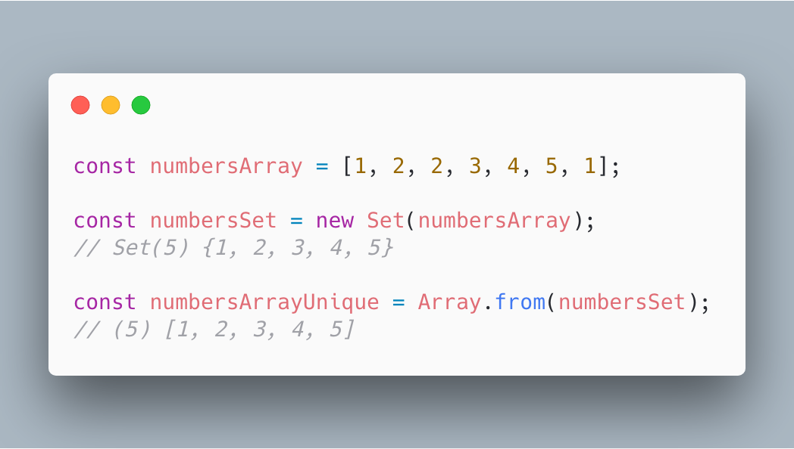
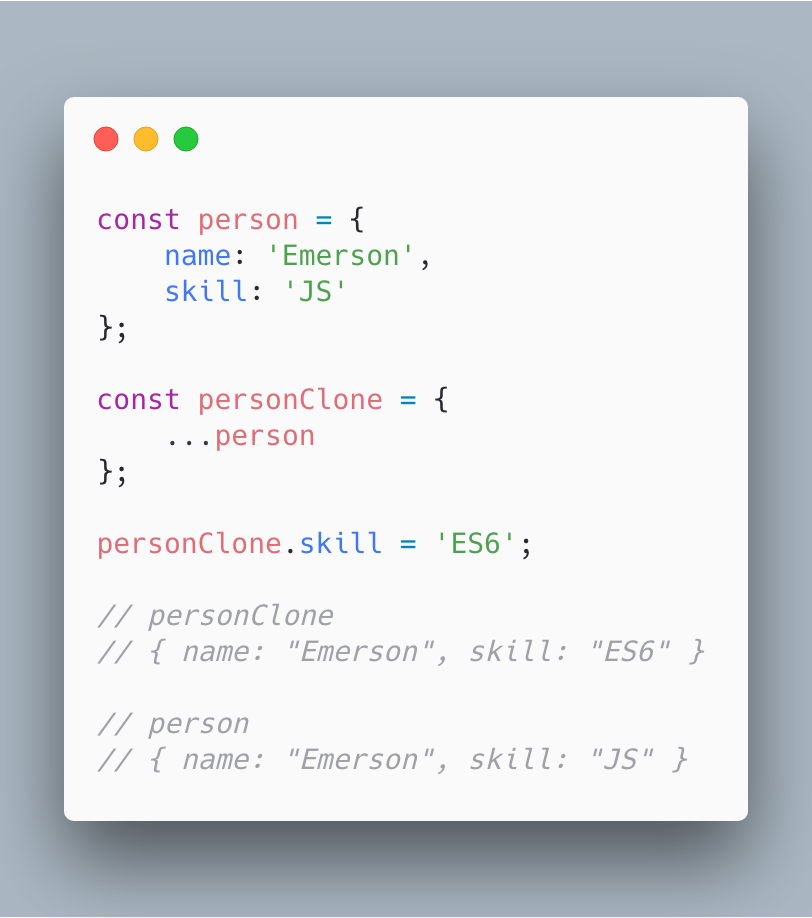
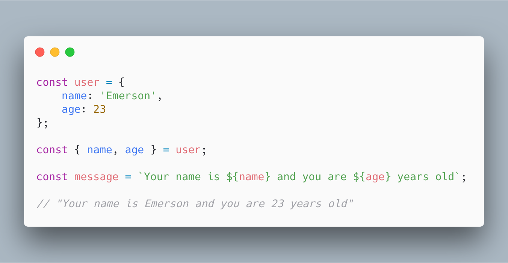
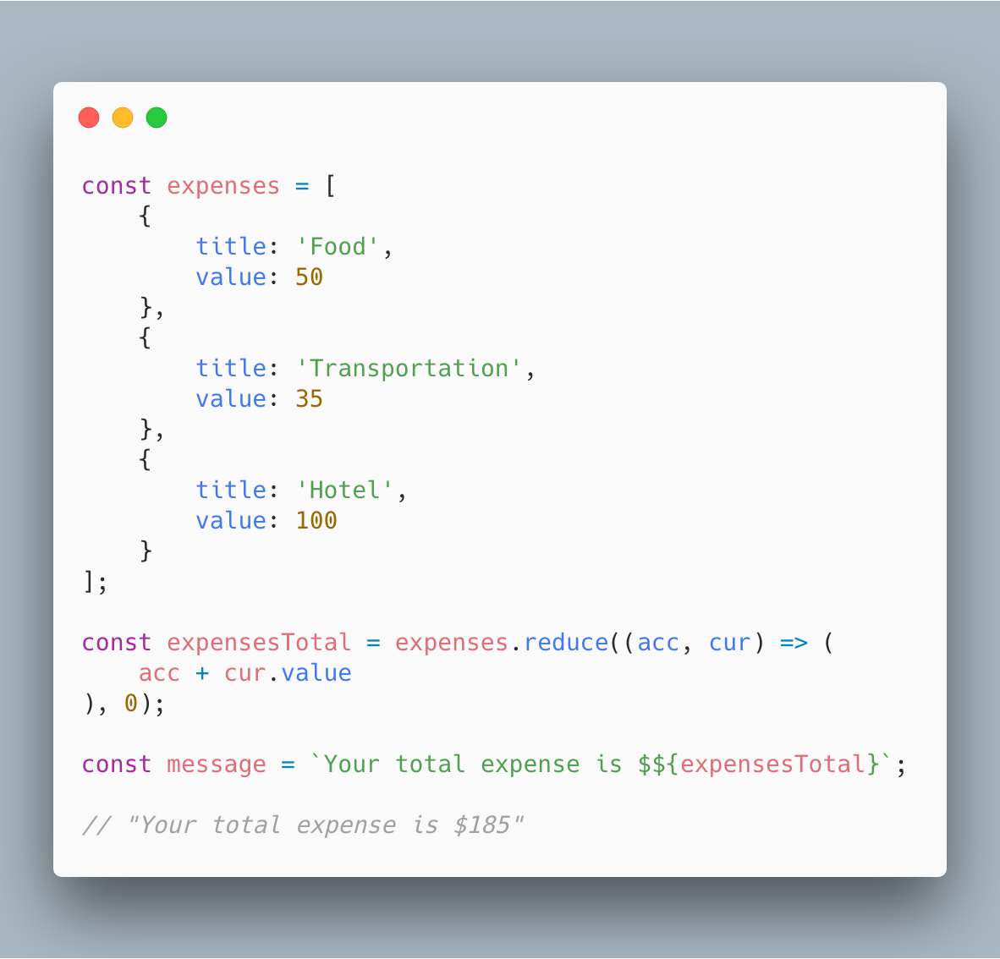
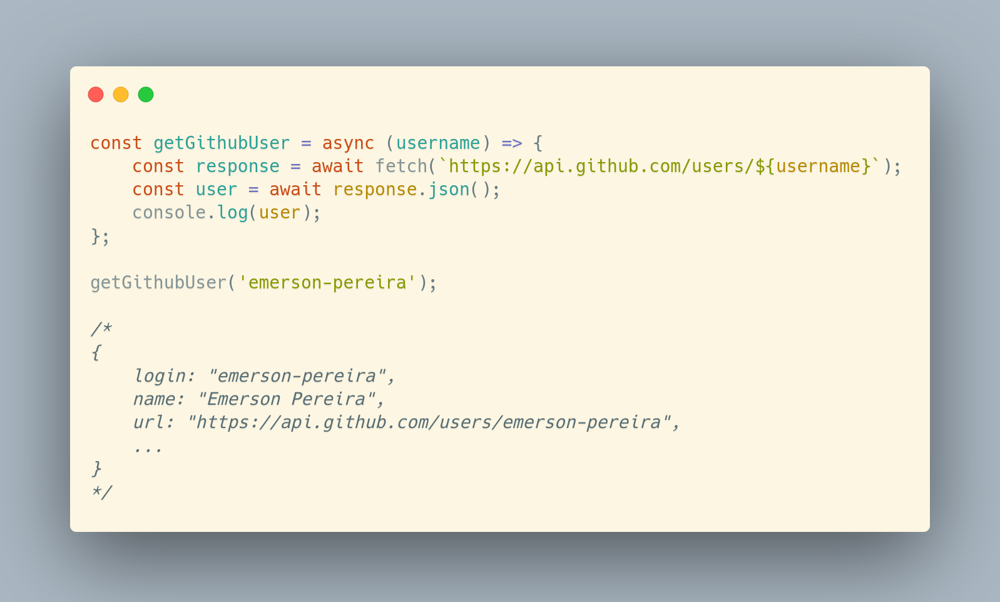

Isso é uma lista de 5 das minhas features favoritas do ECMAScript 6 (ou ES6).

São pequenos "pedaços" de código que eu considero simples porém super incríveis e úteis.

Você pode ver os códigos fonte nesse repositório, testar no copen e compartilhar as imagens ([SVG](https://github.com/emerson-pereira/5-es6-features/blob/master/svg) e [PNG](https://github.com/emerson-pereira/5-es6-features/blob/master/img) dos códigos se quiserem. É tudo free, não tem direito autoral e esse repo tá na licensa MIT.

Dica: Quando vir os exemplos no codepen, lembre de abrir a aba de console pra ver os resultados.

Sem mais delongas aqui vai o número #1.

### 1️⃣ Arrays com valores únicos

[Código](https://github.com/emerson-pereira/5-es6-features/blob/master/features/unique-array.js) | [Codepen](https://codepen.io/emersonmdca/pen/KErYZg)

Fazer um array ter valores únicos é algo muito útil que antes requeria fazer loops usando `for`, `forEach` ou qualquer outra maneira que requer várias linhas de código agora está muito simples com ES6.

Nesse exemplo temos `numbersArray` com o valor `1` e `2` repetidos. Convertendo ele em tipo `Set` faz com que os valores repetidos sejam automáticamente deletados. Depois disso temos que convertelos de volta pra array usando `Array.from()`.

Feito isso você tem um belo array sem nenhum valor repetido usando as magias do `Set()`.

E se você é desses que gosta de escrever tudo em uma linha pra impressionar, você pode combinar os dois:

`Array.from(new Set([1, 2, 2, 1, 1]))` :eyes:

[Leia mais sobre Set](https://developer.mozilla.org/pt-BR/docs/Web/JavaScript/Reference/Global_Objects/Set)

### 2️⃣ Clonando objetos com Spread Operator

[Código](https://github.com/emerson-pereira/5-es6-features/blob/master/features/object-clone.js) | [Codepen](https://codepen.io/emersonmdca/pen/moQgmo)

A dica #2 é sobre clonar objetos. Para evitar o comportamento de referenciação do JavaScript é comum que se precise de clonar objetos. A maneira mais usada anteriormente era o famoso `Object.assign()`. Para evitar esse medonho e verboso método uma maneira muito mais simples e legível de se clonar um objeto é usando o famoso "Três pontinhos", o Spread Operator.

Em suma o que básicamente acontece com o spread é, ele vai por item por item do seu Array ou, nesse caso, Objeto e atribui os mesmos valores. O resultado é um Objeto novo e desvinculado do Objeto inicial, assim evitamos bugs com valores inesperados.

[Leia mais sobre Spread Operator](https://developer.mozilla.org/pt-BR/docs/Web/JavaScript/Reference/Operators/Spread_operator)

### 3️⃣ Usando Template String e acessando objetos com Destructuring

[Código](https://github.com/emerson-pereira/5-es6-features/blob/master/features/template-string-and-destructuring.js) | [Codepen](https://codepen.io/emersonmdca/pen/drQLVg)

Aqui temos duas features:

- Template String: é uma maneira de declarar uma String e interpolar valores de uma maneira muito mais legível. Basta usar o "backtick" ao invés de aspas e envoler o valor em `${}`.

- Destructuring ou Desestruturação: Trate-se de forma diferente de acessar propriedades de Obejtos ou itens de Arrays. Você consegue declarar variáveis com o nome da propriedade interna do objeto diretamente. Isso deixa o código menos verboso e muito mais legível.

[Leia mais sobre Atribuicao via desestruturacao](https://developer.mozilla.org/pt-BR/docs/Web/JavaScript/Reference/Operators/Atribuicao_via_desestruturacao)

[Leia mais sobre Template Strings](https://developer.mozilla.org/pt-BR/docs/Web/JavaScript/Reference/template_strings)

### 4️⃣ Somando total de valores de obejto com Reduce

[Código](https://github.com/emerson-pereira/5-es6-features/blob/master/features/reduce.js) | [Codepen](https://codepen.io/emersonmdca/pen/xBQezz)

Essa é das features que mais me confundiu no início porém quanto mais eu uso mais eu gosto: Reduce.

Com o reduce conseguimos fazer um loop em um Array e ir incrementando um valor inicial a cada iteração. Tudo isso numa syntax bem poderosa.

O método reduce tem dois parâmetros. O primeiro `acc` é o acumulador (acc = accumulator). E ele precisa ser iniciado com algum valor, no nosso caso: `0`.
O segundo é cada items do loop que estamos fazendo, nesse exemplo, um Objeto `{ title: '...', value: ... }`.

A gente, então, começa com o valor em 0, e apartir daí somamos com a propriedade `value` do Objeto atual de cada iteração. É um dos meus métodos preferidos e as possibilidades são muitas.

[Leia mais sobre Reduce](https://developer.mozilla.org/pt-BR/docs/Web/JavaScript/Reference/Global_Objects/Array/reduce)

### 5️⃣ Pegando dados de API com o método Fetch usando Async / Await

[Código](https://github.com/emerson-pereira/5-es6-features/blob/master/features/async-await.js) | [Codepen](https://codepen.io/emersonmdca/pen/QoJooe)

Deixei o meu preferido por úlitmo. Async Await com a API Fetch do browser.

Aqui a gente faz uma busca na API pública do GitHub. Usamos o endpoint que retorna algumas informações sobre um usuário do GitHub, buscando pelo seu username.

O método `fetch`, é um método assíncrono, então ele retorna uma Promise. Isso por si só já é incrível e eu podia parar por aqui, mas vamos além.

Aqui a gente combina o Async / Await que, básicamente, nos permite um approach síncrono com Promises.
O que isso faz é permitir que usemos declarações da direita pra esquerda e attribuir valores do retorno de uma Promise em uma váriavel da maneira que faríamos proceduralmente (síncronamente).

Pra isso basta declarar o `async` antes da sua função e `await` antes da chamada que se espera um retorno de uma Primise e pronto.

Essas duas features são,de longe, as que eu mais gosto no ECMAScript 6 e espero que vocês tenham gostado também.

[Leia mais sobre Fetch](https://developer.mozilla.org/pt-BR/docs/Web/API/Fetch_API)

[Leia mais sobre Async / Await](https://developer.mozilla.org/pt-BR/docs/Web/JavaScript/Reference/Statements/funcoes_assincronas)

_Imagens criadas com [Carbon](https://carbon.now.sh)_
