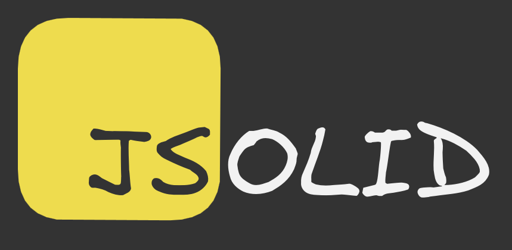

SOLID principles, let me show you where the concept has been popping up in the past few months…



## Princípio da responsabilidade única

_**S**: Single Responsability Principle_

> Só porque você pode não significa que você deveria.

Entidades devem ter apenas uma responsabilidade.

### 🚌💥
```js
function dirigirOnibusECobrarPassagem() {
    // Excesso de responsabilidade
    // Atropelar pedestre
    // Passar troco errado
}
```

✨ Responsabilidade única:

```js
function dirigirOnibus() {
    // Dirigir com atenção
}

function cobrarPassagem() {
    // Cobrar com calma
}
```

## Princípio do aberto-fechado

_**O**: Open-Closed Principle_

> Em time que tá ganhando não se mexe.

Entidades devem estar abertas para extensões mas fechadas para modificações.

### 🚌

```js
class Motorista {
    dirigirOnibus() {
        // dirigir ônibus 
    }
}
```

🚛 🔥🚌🔥 Fechado:

```js
class Motorista() {
    dirigirCaminhao() {
        // dirigir caminhão
    }
}
```

🚌 🚛 Aberto:

```js
class Motorista() {
    dirigirOnibus() {
        // dirigir ônibus
    }
    dirigirCaminhao() {
        // dirigir caminhão
    }
}
```

## Princípio da substituição de Liskov

_**L**: Liskov Substitution Principle_

> Tem que voltar pra base ★.

Subclasses devem ser substituíveis pelas classes base das quais foram derivadas.

Classe base:

```js
class Motorista {
    dirigir() {}
}
```

🚌💥 Não substituível:

```js
class Cobrador extends Motorista {
    cobrar() {}
}
```

🚛 Substituível:

```js
class MotoristaDeCaminhao extends Motorista {
    estacionar() {}
}
```

`Cobrador` não é substituível pela classe base `Motorista` pois o cobrador não poderia dirigir e o motorista não poderia cobrar.

`MotoristaDeCaminhao` é substituível pela classe base `Motorista` pois o motorista de caminhão poderia dirigir e o motorista poderia estacionar:

## Princípio de segregação de interface

_**I**: Interface Segregation Principle_

> Dividir para conquistar.

Classes não devem ser forçadas a dependeper de métodos que não usam.

## Princípio de inversão de dependência

_**D**: Dependency Inversion Principle_

> Não tenho rabo preso com ninguém.

Módulos de alto nível não devem depender de módulos de baixo nível. Ambos devem depender da abstração.

Abstrações não devem depender de detalhes. Os detalhes devem depender das abstrações.

<!-- <div style="width: 240px"></div> -->
