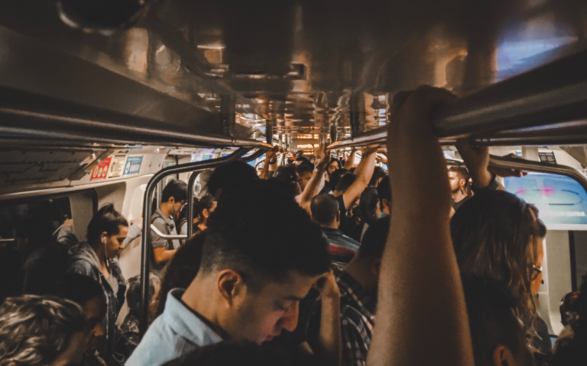

Penso que é essencial para qualquer pessoas a busca por conhecimento, não somente técnico mas também histórico, filosófico, científico.

[Sociologia pra entender o Brasil](https://icl.com.br/curso/sociologia/) é o nome do curso do Jessé Souza no [Instituto Conhecimento Liberta](https://icl.com.br/). Esse artigo é para registrar algumas das idéias que obtive a partir dessas aulas.

[Metrô lotado](https://unsplash.com/photos/a-group-of-people-riding-on-a-subway-train-Iv3eg_W_DFY)

A sede pelo conhecimento sempre me seduziu o que me levou a conhecer ferramentas novas e me tornar um engenheiro de software. Essa mesma chama me leva a buscar conhecimento sobre o mundo em que vivemos o que tem impacto direto na vida pois aprendi que só o conhecimento liberta e liberdade é um atributo essencial para qualquer ser-humano.
Pra ser bom profissional precisa primeiro ser humano, empático e ter pensamento crítico. Não adiantará em nada ser um engenheiro excepcional em um mundo mediano e por isso busco não só aprimorar minhas habilidades tecnológicas como também as humanas por meio da história, filosofia e ciência.
Esse curso com Jessé me ajudou em muito a perceber a minha história como um brasileiro pintando um quadro de como as relações são postas historicamente até hoje e me permitiu criar noções de como a sociedade é dividade se relaciona no Brasil.

Deixo aqui alguma das reflexões que obtive:
- Max Weber terá grande influência nos intelectuais brasileiros que irão trazer, por interpretações questionáveis do autor, a idea hegemônica do que é o povo brasileiro, nos atribuindo caraterísticas tais como a "vira-latismo" que define o brasileiro como aquele de cultura inferior, que está sempre atrás de um "jeitinho", que é miserável porque é preguiçoso etc.
- O protestantismo ascético juntamente ao movimento liberal muda o paradigma de sucesso para a sociedade e faz crer que bem sucedido é aquele que produzir o máximo possível em detrimento do paradigma anterior onde a produção era apenas para sustentar as necessidades da família e conservar-se o tempo livre de vida
- Gilberto Freyre detém esse estigma de raça subjugada nos pintando como um povo festivo, amigável e caloroso. Contrário da cultura americana com bairros separados para italianos, chineses por exemplo.
- Getúlio Vargas avança trazendo a idea de inclusão do povo brasileiro e cria uma imagem de brasilidade
- Em 1808 Portugal traz o aparato do estado que confere lei, impessoalidade jurídica, impulso capitalista, hábitos europeus em comida, vestimenta etc, classe média literária, economia competitiva, valorização dos conhecimentos, técnicos e profissionais
- Sérgio Boarque cria a identidade de vira-lata nacional que molda a concepção de muitos brasileiros até hoje. Essa idea é detrimental para o povo e é usada pela elite econômica como forma de diminuir a alto-estima de um povo para que assim seja mais fácil convencê-lo que merece pouco.
- A corrupção da classe política é existente desde de a roma antiga, até mesmo no Egito até chegar a nós brasileiros por herança ibérica mas mais detrimental que a corrupção dos políticos é a corrupção da elite econômica que saqueia a riqueza nacional para o benefício de uma minoria diminuta em nome da perda de garantia de humanidade nacional. A exemplo tivemos o que é considerado o maior rombo da história do mercado financeiro brasileiro recentemente com o Golpe das Lojas Americanas que trouxe prejuízo de dezenas de bilhões aos brasileiros.
- A atribuição do povo brasileiro como corrupto ajuda a estigmatizá-lo para o seu detrimento como se escândalos políticos fosse uma exclusividade brasileira e idealiza o USA e Europa como exemplos de honestidade, divino, perfeito.
- Classe média (20% dos brasileiros) se da pelo acúmulo de privilégios e não pela renda. O eventual aumento do poder de compra de classe não-privilegiadas não as confere as garantias existentes para a classe média de acesso a cultura, educação, saúde, respeito, direitos por herança. Essa estrutura de classe permite o desenvolvimento do racismo de raça e racismo de classe.

## O mau trato aos menos privilegiados

Jessé menciona nesse curso a [história narrada por Brás Cubas de Machado de Assis do escravizado Prudêncio](https://educacaosemdistancia.emnuvens.com.br/esd/article/download/127/57/306) que ao ser feito livre por seu senhor tratava os escravizados pior que os próprios senhores de escravizados. Esse é um fenômeno que explica a raiva e racismo e racismo de classe que se percebe em parte da classe média brasileira para aqueles menos privilegiados. Esse comportamento pode ter explicação na frustração de não pertencer a elite econômica e como classe média ser ainda trabalhadora e apenas detentora de privilégios e para a manutenção desses privilégios, medo de os perder age de forma a manifestar desprezo pelos menos favoráveis, comportamento parecido com aquele de Prudêncio que surpreendia até mesmo aos senhores com sua agressão ao escravizados, classe daquele ele mesmo fora.

## Conclusão

Para concluir, Jessé Souza ao trazer esse contexto histórico refuta a ideia do brasileiro como raça subjugada e vira-lata para trazer uma ideia de brasilidade mais humanista onde nos coloca como consequência dessas ideias hegemônicas criadas e suportadas por diferentes intelectuais ao longo de nossa história.
Essa análise traz para nós brasileiros auto-estima e nos ajuda a livrar-nos dos idealismos criados que nos põem como inferiores.
Traz a reflexão dos motivos de um país tão rico como o Brasil poder produzir pessoas tão miseráveis e nos dá uma visão de futuro para o caminho de um nação igualitária e humanista com uma brasilidade livre de estigmas e com valores poderosos que já temos mas nos são negados.

Como brasileiro já naveguei por esses conflitos de classe, fiquei confuso, adquiri a tal do síndrome do vira-lata e pensei de mim mesmo de forma diminutiva devido as ideias que foram a mim expostas. Com essas ideas revolucionárias trazidas por Jessé de Souza eu consigo hoje perceber melhor como a nossa identidade nacional foi criada e certamente muda minha noção de brasileiro e brasilidade para algo muito mais positivo, humanista, não inferiorizante e de orgulho.

Para além de conhecimentos técnicos busco o conhecimento humano, e esse curso foi um passo a mais na busca e isso já faz de mim uma profissional e uma pessoa melhor.

PS: Esse post não tem patrocínio de nenhuma forma do [ICL](https://icl.com.br/), até porque é uma organização independente. Faço questão de colocá-los aqui pois acredito verdadeiramente nessa missão e aprendo muito dos cursos o programas.

Busque conhecimento 👽
