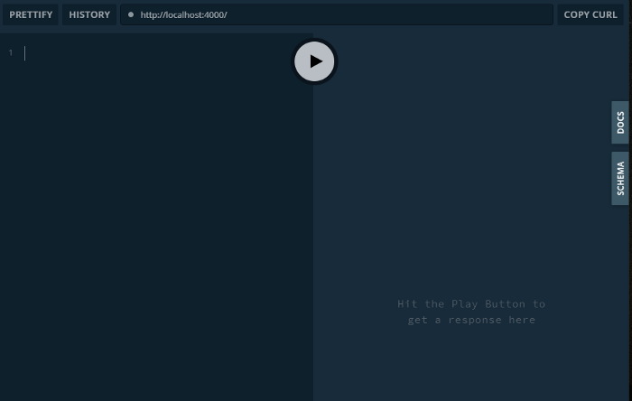

Este artigo é um tutorial de como montar um servidor GraphQL e faz parte de uma série de 2 tutoriais para montar uma aplicação em GraphQL.

Se quiser saber o que é GraphQL primeiro, veja o seguinte artigo:

📝 [_GraphQL: O que é e como usar_](/blog/introducao-a-graphql)

Você pode acompanhar o tutorial passo-a-passo ou clonar o repositório completo do GitHub.<br />
Além disso eu disponibilizei uma versão online (sem mutations para que não haja mudança nos dados online) a título de exemplo do resultado final da API.

Links do projeto:

- **Código no GitHub**: [github.com/emerson-pereira/frutas](https://github.com/emerson-pereira/frutas)

- **Versão online da API**: [graphql-frutas.herokuapp.com](https://graphql-frutas.herokuapp.com/)

- **Versão online App React**: [codesandbox.io/s/graphql-frutas-4isf8](https://codesandbox.io/s/graphql-frutas-4isf8)

## A proposta

A proposta é um website sobre frutas onde podemos gerenciar os dados fazendo as operações **CRUD**. O site será feito em React.js e o servidor será em Node.js. Nesse tutorial desenvolveremos a **API em GraphQL**.

## O stack

Para essa aplicação teremos:

- Servidor GraphQl em [Node.js](https://nodejs.org/en/)
- [Apollo server](https://www.apollographql.com/docs/apollo-server/) para montar o servidor
- Banco de dados [MongoDB](https://www.mongodb.com/)

## Estrutura inicial

Para começar o projeto crie uma pasta chamada `fruits` e dentro dela crie uma pasta `backend`. Então ficamos com a seguinte estrutura de pastas:

```
📦fruits
┣ 📂backend
```

Abra um terminal de comandos e navegue para a pasta `fruits/backend` e execute os comandos a baixo:

#### Inciar npm

```bash
npm init -y
```

#### Instalar dependências

```bash
npm i graphql apollo-server mongoose dotenv
```

- **graphql**: Montar shemas e executar queries GraphQL
- **apollo-server**: Montar servidor GraphQL
- **mongoose**: Modelar dados do banco e conectar ao banco MongoDB
- **dotenv**: Configurar variáveis de ambiente para MongoDB

## Sobre o servidor

Um servidor GraphQL contém principalmente **definições de tipo** e **resolvers**. Além disso, para configurar o acesso ao banco de dados e o eschema dos dados do banco, teremos mais um item chamado **Models**. Dessa forma nosso servidor terá 3 principais itens:

- **Definições de tipo**: Modelar dados com schemas
- **Resolvers**: Definir como buscar e alterar os dados
- **Models**: Definir dados e abrir interface para dados no banco

## Configurando o servidor

Na pasta `backend`, crie uma nova pasta chamada `src`.

Em `backend/src` crie um arquivo `index.js` e adicione o seguinte código:

_Caminho_: `backend/src/index.js`

```js
const { ApolloServer } = require("apollo-server")
const typeDefs = require("./typeDefs")
const resolvers = require("./resolvers")

const server = new ApolloServer({ typeDefs, resolvers })

server
  .listen()
  .then(({ url }) => console.log(`Server ready at ${url}`))
  .catch(error => console.log("Server failed: ", error))
```

Como pode perceber no arquivo index.js fazemos chamadas para `typeDefs` (Definições de tipo) e `resolvers`, porém esses arquivos ainda não existem então vamos criá-los.

## Criando Definições de Tipo

Nessa parte vamos criar as definições de tipo. As definições de tipo consistem de 3 items:

- **Types**: Modelar dados com schemas
- **Query**: Definir queries e associar aos tipos criados
- **Mutation**: Definir mutation e associar aos tipos criados

Para criarmos as definições de tipo crie uma pasta chamada `typeDefs` em `backend/src` e crie os arquivos de acordo com a estrutura a seguir:

_Caminho_: `backend/src`

```
📂typeDefs
┣ 📜index.js
┣ 📜mutation.js
┣ 📜query.js
┣ 📜types.js
```

### Types

Vamos começar criando os tipos (types) de dados que teremos na API GraphQL. É nessa parte que se modela os dados.

Em typeDefs/types.js cole o seguinte código:

_Caminho_: `backend/src/typeDefs/types.js`

```js
const { gql } = require("apollo-server")

const types = gql`
  type Fruit {
    id: ID!
    name: String
    nutritions: Nutritions
  }
  type Nutritions {
    calories: String
    sugar: String
  }
`

module.exports = types
```

Teremos apenas dois tipos de dados, um para frutas e uma para nutrições que incluem algumas informações sobre a fruta. E como pode perceber o tipo `Nutritions` na verdade é usado dentro do tipo `Fruit` de forma combinada. GraphQL permite fazer combinações de tipos e isso resulta em uma resposta unificada com os dados num mesmo JSON:

```json
{
  "id": "123",
  "name": "Banana",
  "nutritions": {
    "calories": "96",
    "sugar": "17.2"
  }
}
```

### Query

Agora vamos montar as queries. Para configurar uma query basta dar um nome e atribuir a um type. Aqui, teremos duas queries: uma que retorna um array com todas as frutas e uma que retorna uma fruta a partir de seu id.

Em `typeDefs/query.js` cole o seguinte código:

_Caminho_: `backend/src/typeDefs/query.js`

```js
const { gql } = require("apollo-server")

const query = gql`
  type Query {
    fruits: [Fruit]
    fruit(id: ID!): Fruit
  }
`

module.exports = query
```

Pronto as queries estão definidas. No trecho de código acima dissemos ao servidor que a query chamada `fruits` deve retornar um array com dados do tipo `Fruit` (definido no passo anterior) e a query chamada `fruit` deve ter um parâmetro chamado `id` com um dado do tipo `ID` (já existente em GraphQL) e retornar um item do tipo `Fruit`.

A exclamação (`!`) ao final do tipo `ID`define o campo como obrigatório.

### Mutation

Agora nos resta definir as mutations. Essa parte é bem parecida com as definições de queries. Mutations são queries que fazem alteração nos dados.

Em `typeDefs/mutation.js` cole o seguinte código:

_Caminho_: `backend/src/typeDefs/mutation.js`

```js
const { gql } = require("apollo-server")

const mutation = gql`
  type Mutation {
    createFruit(fruit: FruitInput): Fruit
    updateFruit(id: String, fruit: FruitInput): Fruit
    deleteFruit(id: String): Fruit
  }
  input FruitInput {
    name: String
    nutritions: NutritionsInput
  }
  input NutritionsInput {
    sugar: String
    calories: String
  }
`

module.exports = mutation
```

Alem do tipo `Mutation` estão definidos alguns tipos `input`, esses inputs são para separar os parâmetros passados a mutation a fim de deixar as assinaturas mais limpas e de fácil manutenção.

### Concluindo definições de tipo

Para concluir essa parte, no arquivo typeDefs/index.js cole o seguinte código:

_Caminho_: `backend/src/typeDefs/index.js`

```js
const query = require("./query")
const mutation = require("./mutation")
const types = require("./types")

const typeDefs = [query, mutation, types]

module.exports = typeDefs
```

Definições de tipos estão feitas! Agora basta definir **resolvers** e **models**.

## Criando Models

Antes de definir os resolvers, vamos criar os models para que possamos modelar os dados ao banco e também usar como interface para conectar a eles. Na verdade teremos apenas uma model: a de frutas.

Dentro da pasta `src` crie uma pasta chamado `models`. <br />
Dentro dela crie um arquivo `Fruit.js`. <br />
Neste arquivo cole o seguinte código:

_Caminho_: `backend/src/models/Fruit.js`

```js
const mongoose = require("mongoose")

const FruitSchema = mongoose.Schema({
  name: String,
  nutritions: {
    sugar: String,
    calories: String,
  },
})

module.exports = mongoose.model("Fruit", FruitSchema)
```

E assim também fechamos a parte de models.<br />
Agora resta configurar os **resolvers** e a acabamos com configurações de servidor.

## Criando Resolvers

Resolvers é onde associamos quais ação queries e mutations devem tomar. No nosso caso as ações são fazer chamadas ao banco de dados. Desta maneira, usamos **models** para implementar funções do banco de dados uma vez que são as models que fazem a interface com banco.

Dentro da pasta `src` crie uma pasta chamado `resolvers`.
Dentro dela crie um arquivo `fruitResolver.js`.
Neste arquivo cole o seguinte código:

_Caminho_: `backend/src/resolvers/fruitResolver.js`

```js
const Fruit = require("../models/Fruit")

const fruitResolver = {
  Query: {
    fruits() {
      return Fruit.find()
    },
    fruit(_, { id }) {
      return Fruit.findById(id)
    },
  },
  Mutation: {
    createFruit(_, { fruit }) {
      const newFruit = new Fruit(fruit)
      return newFruit.save()
    },
    updateFruit(_, { id, fruit }) {
      return Fruit.findByIdAndUpdate(id, fruit, { new: true })
    },
    deleteFruit(_, { id }) {
      return Fruit.findByIdAndRemove(id)
    },
  },
}

module.exports = fruitResolver
```

Neste arquivo usamos métodos expostos pela biblioteca [Mongoose](https://mongoosejs.com/) onde criamos a model no passo anterior. Dessa forma associamos as queries e mutations criadas nas definições de tipos à ações no banco de dados MongoDB.

Uffa. Configurações de servidores todas prontas! <br />
Agora basta configurar a **conexão ao banco** e a API estará pronta pra teste.

## Conectando ao banco

Para conectar ao banco usaremos [DotEnv](https://github.com/motdotla/dotenv#readme) para armazenar as credenciais do banco. Essa biblioteca permite criar variáveis de ambiente onde podemos ter as credenciais do banco ao invés de tê-las no código o que comprometeria as informações deixando disponíveis a qualquer pessoas com acesso ao código, por exemplo, num repositório git.

Dentro da pasta crie um arquivo `backend` crie um arquivo chamado `.env`:

_Caminho_: `backend/.env`

```bash
DB_HOST=localhost:27017
DB_USER=maria
DB_PASS=maria123
DB_NAME=fruits
```

Neste arquivo adicione as credenciais referente a instância de MongoDB que preferir. Pode ser usado uma instância cloud, usando [MongoDB Cloud](https://cloud.mongodb.com/) ou em localhost caso prefira instalar MongoDB localmente. Caso escolha a segunda opção basta deixar o item `BD_HOST` com `localhost:27017` pois essa é a porta padrão do MongoDB.

Recomendo a ferramenta [MongoDB Compass](https://www.mongodb.com/products/compass) para visualizar / gerenciar o banco de dados.

Agora modifique o arquivo `src/index.js` para adicionar a conexão ao banco:

_Caminho_: `backend/src/index.js`

```js
require("dotenv").config()

const mongoose = require("mongoose")
const { ApolloServer } = require("apollo-server")
const typeDefs = require("./typeDefs")
const resolvers = require("./resolvers")

// Database
const db = {
  host: process.env.DB_HOST,
  user: process.env.DB_USER,
  pass: process.env.DB_PASS,
  name: process.env.DB_NAME,
}
const dbUri = `mongodb+srv://${db.user}:${db.pass}@${db.host}/${db.name}?retryWrites=true&w=majority`
const dbOptions = {
  useNewUrlParser: true,
  useUnifiedTopology: true,
  useFindAndModify: false,
}
mongoose
  .connect(dbUri, dbOptions)
  .then(() => console.log("Database connected"))
  .catch(error => console.log("Databased failed: ", error))

// GraphQL
const server = new ApolloServer({ typeDefs, resolvers })
server
  .listen()
  .then(({ url }) => console.log(`Server ready at ${url}`))
  .catch(error => console.log("Server failed: ", error))
```

Na primeira linha adicionamos `dotenv` para carregar as credenciais em variável de ambiente. Feito isso elas todas ficam acessíveis em `process.env`.

**API GraphQL feita!**

Veja a estrutura final de pastas:

```
📦fruits
 ┣ 📂backend
 ┃ ┣ 📂src
 ┃ ┃ ┣ 📂models
 ┃ ┃ ┃ ┗ 📜Fruit.js
 ┃ ┃ ┣ 📂resolvers
 ┃ ┃ ┃ ┣ 📜fruitResolver.js
 ┃ ┃ ┃ ┗ 📜index.js
 ┃ ┃ ┣ 📂typeDefs
 ┃ ┃ ┃ ┣ 📜index.js
 ┃ ┃ ┃ ┣ 📜mutation.js
 ┃ ┃ ┃ ┣ 📜query.js
 ┃ ┃ ┃ ┗ 📜types.js
 ┃ ┃ ┗ 📜index.js
 ┃ ┣ 📜.env
 ┃ ┣ 📜package.json
```

**Lembrete**: O código final desse projeto está [disponível no GitHub](https://https://github.com/emerson-pereira/frutas/).

Agora podemos testar nossas queries e mutations. O framework Apollo Server oferece um [Playground](https://www.apollographql.com/docs/apollo-server/testing/graphql-playground/) onde podemos performar tais testes.

## Testando a API

Para conseguir iniciar o servidor a partir do npm, abra o arquivo `package.json` e isira o seguinte script:

_Caminho_: `backend/package.json`

```json
{
   …
   "scripts": {
      "start": "node src/index.js"
   }
   …
}
```

No terminal, navegue até o diretório `backend` e inicie o servidor:

```bash
npm start
```

Abrirá uma janela no browser com o playground:



**_Bem vindo a linguagem de query em gráfico!_**

Agora podemos testar a API com queries e mutations usando o playground.

### O Playground

Playground é uma UI onde se pode testar as queries e mutations definidas no servidor. Do lado esquerdo da tela é campo de teste onde se pode escrever queries e mutations, apertando o botão play ao centro da tela a query é executada e o resultado é posto em JSON no lado direito da tela.

No canto superior-direito da tela tem abas para “Docs” e “Schema” onde é possível verificar queries e mutations disponíveis e seus schemas.

Teste as outras queries e mutations, adicione apenas alguns campos como retorno e veja os resultados.

### Executando queries

Como ainda não existe nenhum dado no banco podemos começar testando a **mutation** de criação de frutas:

```graphql
mutation createFruit {
  createFruit(
    fruit: {
      name: "Maçã"
      nutritions: { sugar: "2.3", calories: "52" }
    }
  ) {
    name
    nutritions {
      sugar
      calories
    }
  }
}
```

Depois buscar com a query de busca de frutas:

```graphql
query getFruits {
  fruits {
    id
    name
    nutritions {
      sugar
      calories
    }
  }
}
```

Para mais informações de como usar queries e mutations veja a documentação: [graphql.org/learn/queries](https://graphql.org/learn/queries)

### Versão online

A título de exemplo, eu publiquei uma [versão online dessa API](https://graphql-frutas.herokuapp.com/) com playground incluso. Essa versão não tem mutations para que não haja mudança nos dados online, isso significa que contém apenas as queries de busca de **frutas** e **fruta por id** a fim de exemplo.

## Conclusão

Temos uma **API em GraphQL** totalmente funcional, com **operações CRUD**, conectada a um **banco de dados** e pronta para ser consumida por clientes.

Links do projeto:

- **Código no GitHub**: [github.com/emerson-pereira/frutas](https://github.com/emerson-pereira/frutas)

- **Versão online da API**: [graphql-frutas.herokuapp.com](https://graphql-frutas.herokuapp.com/)

- **Versão online App React**: [codesandbox.io/s/graphql-frutas-4isf8](https://codesandbox.io/s/graphql-frutas-4isf8)

## Próximo passo

Agora podemos usar clientes para fazer chamadas para essa API. Veja o tutorial de como implementar uma App React.js com Apollo Client para conectar a essa API:

📝 [_Consumindo API GraphQL em React.js com Apollo client_](/blog/tutorial-react-graphql/)
