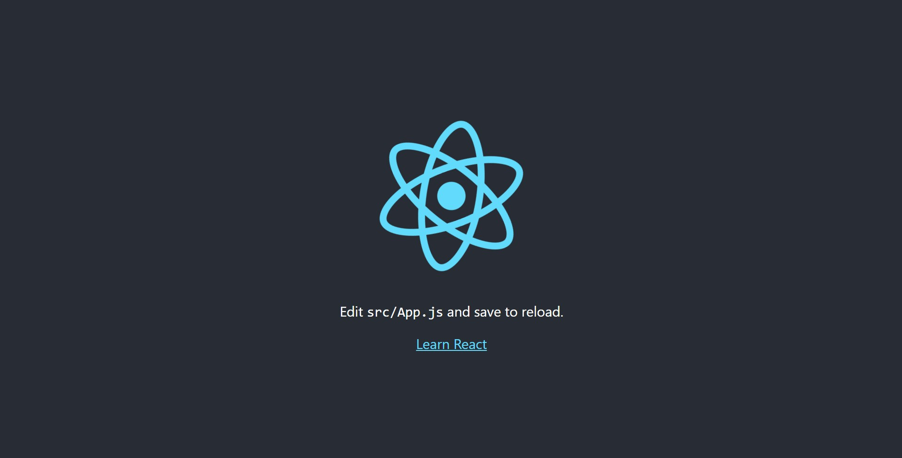
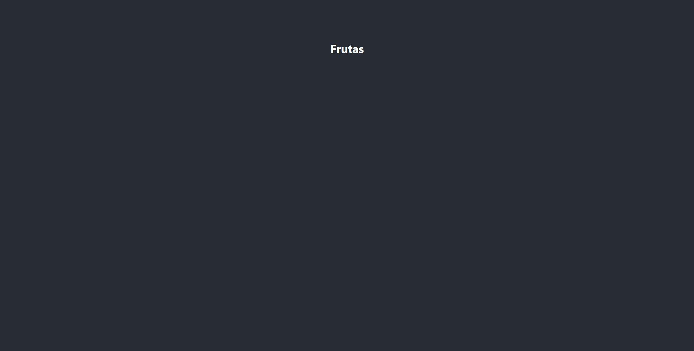

Essa é a segunda e última parte da série de como montar uma aplicação completa em GraphQL. Aqui vamos construir uma aplicação frontend para interagir com o backend criado no primeiro tutorial.

Para seguir com esse tutorial, é necessário noções de GraphQL, além de React.js. Para se familiarizar com GraphQL, veja o seguinte artigo:

📝 [_GraphQL: O que é e como usar_](/introducao-a-graphql)

Se quiser ver o primeiro tutorial de como montar uma API GraphQL, veja o seguinte artigo:

📝 [_Montando API GraphQL em Node.js com Apollo e MongoDB_](/tutorial-api-graphql/)

Você pode acompanhar o tutorial passo-a-passo ou clonar o repositório completo do GitHub.<br />
Além disso eu disponibilizei uma versão online (sem mutations para que não haja mudança nos dados online) a título de exemplo do resultado final da API.

Links do projeto:

- **Código no GitHub**: [github.com/emerson-pereira/frutas](https://github.com/emerson-pereira/frutas)

- **Versão online da API**: [graphql-frutas.herokuapp.com](https://graphql-frutas.herokuapp.com/)

- **Versão online App React**: [codesandbox.io/s/graphql-frutas-4isf8](https://codesandbox.io/s/graphql-frutas-4isf8)

## A proposta

A proposta é um website sobre frutas onde podemos gerenciar os dados fazendo as operações **CRUD**. O site será feito em React.js e o servidor em Node.js. Nesse tutorial desenvolveremos o **frontend em React.js**.

## O stack

No frontend, teremos:

- Framework [React.js](https://reactjs.org/) para construir a aplicação
- [Apollo Client for React.js](https://www.apollographql.com/docs/react/) para consumir dados da API GraphQL em React.js

## Iniciando App React.js

Aqui devemos continuar dentro da pasta `fruits` de onde começamos no tutorial anterior. Dentro dela, execute o seguinte comando para [iniciar um projeto react](https://create-react-app.dev/docs/getting-started/):

```bash
npx create-react-app frontend
```

Quando terminado o processo, uma pasta `frontend` terá sido criada com a aplicação inicial React.js:

```
📦fruits
┣ 📂backend
┣ 📂frontend
┃ ┣ …
```

Abra um terminal de comandos e navegue para a pasta `fruits/frontend`. Verifique que funcionou executando:

```bash
npm start
```

Deverá abrir a tela inicial gerada com create-react-app na porta 3000:

[http://localhost:3000](http://localhost:3000/)



Aplicação iniciada!

Antes de começarmos, a ferramenta create-react-app cria alguns arquivos que não serão necessários aqui, como arquivos de teste e configuração de service worker. Apague todos esses arquivos, até ficar com a seguinte estrutura:

```
📂frontend
 ┣ 📂public
 ┃ ┣ 📜favicon.ico
 ┃ ┣ 📜index.html
 ┣ 📂src
 ┃ ┣ 📜App.css
 ┃ ┣ 📜App.js
 ┃ ┣ 📜index.css
 ┃ ┣ 📜index.js
 ┣ 📜.gitignore
 ┣ 📜package.json
 ┗ 📜README.md
```

Agora vamos "limpar" alguns arquivos removendo algumas chamadas e demais coisas desnecessárias.

Começando na pasta `public`, abra `index.html` e deixe dessa maneira:

_Caminho_: `frontend/public/index.html`

```html
<!DOCTYPE html>
<html lang="pt-BR">
  <head>
    <meta charset="utf-8" />
    <link rel="icon" href="%PUBLIC_URL%/favicon.ico" />
    <meta
      name="viewport"
      content="width=device-width, initial-scale=1"
    />
    <meta
      name="description"
      content="Um app sobre informações nutricionais de frutas."
    />
    <title>Frutas</title>
  </head>
  <body>
    <noscript>
      You need to enable JavaScript to run this app.
    </noscript>
    <div id="root"></div>
  </body>
</html>
```

Agora, vamos adicionar os estilos que serão usado nesta aplicação. Na pasta `src`, substitua os conteúdos de `index.css` e `App.css` com os seguintes conteúdos:

_Caminho_: `frontend/src/index.css`

```css
body {
  margin: 0;
  font-family: -apple-system, BlinkMacSystemFont, "Segoe UI",
    "Roboto", "Oxygen", "Ubuntu", "Cantarell", "Fira Sans",
    "Droid Sans", "Helvetica Neue", sans-serif;
  -webkit-font-smoothing: antialiased;
  -moz-osx-font-smoothing: grayscale;
}

input,
button {
  padding: 10px;
  font-size: calc(10px + 1vmin);
}

button:hover {
  cursor: pointer;
}

ul {
  list-style: none;
  margin: 20px 0;
  padding: 0;
}

li {
  display: flex;
  justify-content: space-between;
  align-items: baseline;
  padding: 10px;
  margin: 10px;
}
```

_Caminho_: `frontend/src/App.css`

```css
.App {
  text-align: center;
}

.App-header {
  background-color: #282c34;
  color: white;
  position: absolute;
  top: 10%;
  right: 0;
  width: 100vw;
}
.App-header h1 {
  margin: 0;
  padding: 20px;
}

.App-body {
  background-color: #282c34;
  min-height: 100vh;
  display: flex;
  flex-direction: column;
  align-items: center;
  justify-content: center;
  font-size: calc(10px + 2vmin);
  color: white;
}

.App-viewbox {
  position: relative;
}

.App-close-btn {
  position: absolute;
  top: -100px;
  right: -100px;
}

.App-close-btn button {
  background: none;
  border: 0;
  color: white;
  font-size: calc(10px + 2vmin);
}

.App-btn {
  max-width: 120px;
  width: 100%;
}

.App-btn.secondary {
  background: transparent;
  border: 2px solid white;
  color: white;
}

.App-item-actions {
  margin-left: 40px;
}

.App-item-actions a {
  margin: 0 10px;
  background: none;
  text-decoration: none;
}

.App-item-actions a:hover {
  cursor: pointer;
}
```

Estilos adicionados. Agora vamos a pasta `index.js` dentro de `src` e certificar que o arquivo está como a seguir:

_Caminho_: `frontend/src/index.js`

```jsx
import React from "react"
import ReactDOM from "react-dom"
import "./index.css"
import App from "./App"

ReactDOM.render(
  <React.StrictMode>
    <App />
  </React.StrictMode>,
  document.getElementById("root")
)
```

E agora, o último arquivo a ser checado antes de começarmos com a aplicação. Deixe `src/App.js` da seguinte maneira:

_Caminho_: `frontend/src/App.js`

```jsx
import React from "react"
import "./App.css"

function App() {
  return (
    <div className="App">
      <div className="App-header">
        <h1>Frutas</h1>
      </div>
      <div className="App-body"></div>
    </div>
  )
}

export default App
```

Agora salve tudo e abra no navegador, certifique que não há erros no console. Deverá aparecer dessa forma:



Assim, concluímos a configuração inicial do projeto, vamos agora ao próximo passo.

## Configurando rotas

Para facilitar a navegação entre rotas, vamos usar a bibliotéca [React router](https://reactrouter.com/web/guides/quick-start). Instale-a com o comando:

```bash
npm i react-router-dom
```

Dentro da pasta `src` crie um arquivo chamado `routes.js` e inicie as rotas dessa maneira:

_Caminho_: `frontend/src/routes.js`

```jsx
import React from "react"
import {
  BrowserRouter as Router,
  Switch,
  Route,
} from "react-router-dom"

import Fruits from "./components/Fruits"

const Routes = () => (
  <Router>
    <Switch>
      <Route exact path="/">
        <Fruits />
      </Route>
    </Switch>
  </Router>
)

export default Routes
```

A propriedade `path` indica em qual caminho da aplicação aquele componente será exibido, no caso de `Fruits`, este será exibido na home da aplicação.

Agora, vamos criar o componente `Fruits.js` que está sendo chamando no arquivo de rotas. Esse componente mostrará uma lista de frutas assim como as ações de **exibir**, **editar** e **excluir** de cada fruta.

Dentro de `src`, crie uma pasta `components`. Dentro desta, crie o componente de frutas:

_Caminho_: `frontend/src/components/Fruits.js`

```jsx
import React from "react"
import { Link } from "react-router-dom"

const FruitsList = () => {
  return (
    <>
      <ul>
        <li>
          <span>Banana</span>
          <div className="App-item-actions">
            <Link>
              <span role="img" aria-label="visualizar">
                👀
              </span>
            </Link>
            <Link>
              <span role="img" aria-label="editar">
                ✏️
              </span>
            </Link>
            <Link>
              <span role="img" aria-label="excluir">
                ❌
              </span>
            </Link>
          </div>
        </li>
      </ul>

      <p>
        <Link>
          <button>Nova Fruta</button>
        </Link>
      </p>
    </>
  )
}

export default FruitsList
```

Por enquanto adicionamos uma lista com apenas uma fruta.

Também criamos `Link` ao redor dos botões, mas não apontamos para nenhuma rota, nesse momento. Faremos isso mais a frente.

Agora, vá até `App.js` e inclua a rota criada:

_Caminho_: `frontend/src/App.js`

```jsx
import React from "react"
import "./App.css"
// highlight-next-line
import Routes from "./routes"

function App() {
  return (
    <div className="App">
      <div className="App-header">
        <h1>Frutas</h1>
      </div>
      <div className="App-body">
        // highlight-next-line
        <Routes />
      </div>
    </div>
  )
}

export default App
```

Certifique que a lista de frutas criada aparece na tela inicial da aplicação.

Agora, o próximo passo:

## Conectando à API GraphQL com Apollo

Vamos começar instalando as depedências para usar apollo client.

**Nota**: Aqui estamos usando apollo client na versão 3.

```bash
npm i @apollo/client graphql
```

- **@apollo/client**: Pacote apollo com o necessário para usar Apollo client
- **graphql**: Pacote oficial do graphql com a lógica para parsear queries

Agora, efetuamos a conexão usando a URL da API no backend. Como estamos desenvolvendo tudo localmente, vamos fornecer a URL local do backend que serve na porta 4000.

_Caminho_: `frontend/src/App.js`

```jsx
import React from "react"
// highlight-start
import {
  ApolloProvider,
  ApolloClient,
  InMemoryCache,
} from "@apollo/client"
// highlight-end
import "./App.css"
import Routes from "./routes"

// highlight-start
const client = new ApolloClient({
  uri: "http://localhost:4000",
  cache: new InMemoryCache(),
})
// highlight-end

function App() {
  return (
    // highlight-next-line
    <ApolloProvider client={client}>
      <div className="App">
        <div className="App-header">
          <h1>Frutas</h1>
        </div>
        <div className="App-body">
          <Routes />
        </div>
      </div>
      // highlight-next-line
    </ApolloProvider>
  )
}

export default App
```

Agora vamos voltar ao componente `Fruits.js` e popular o componente com dados vindos da API usando o Apollo client.

_Caminho_: `frontend/src/components/Fruits.js`

```jsx
import React from "react"
// highlight-next-line
import { gql, useQuery } from "@apollo/client"
import { Link } from "react-router-dom"

// highlight-start
export const GET_FRUITS = gql`
  {
    fruits {
      id
      name
    }
  }
`
// highlight-end

const FruitsList = () => {
  // highlight-start
  const { loading, error, data } = useQuery(GET_FRUITS)
  if (loading) return <p>Loading...</p>
  if (error) return <p>Error :(</p>
  // highlight-end

  return (
    <>
      <ul>
        // highlight-start
        {data.fruits &&
          data.fruits.map(({ name, id }) => (
            <li key={id}>
              <span>{name}</span>
              <div className="App-item-actions">
                <Link to={`/fruit/${id}`}>
                  <span role="img" aria-label="visualizar">
                    👀
                  </span>
                </Link>
                <Link to={`/editFruit/${id}`}>
                  <span role="img" aria-label="editar">
                    ✏️
                  </span>
                </Link>
                <Link to={`/deleteFruit/${id}`}>
                  <span role="img" aria-label="excluir">
                    ❌
                  </span>
                </Link>
              </div>
            </li>
          ))}
        // highlight-end
      </ul>

      <p>
        // highlight-next-line
        <Link to="/createFruit">
          <button>Nova Fruta</button>
        </Link>
      </p>
    </>
  )
}

export default FruitsList
```

E simples assim, fizemos a query e populamos o componente com dados da API. Ainda fizemos um retorno simples ao usuário com feedback de loading e de erro, caso ocorra algum.

Além disso, de antemão, apontamos rotas para cada ação [CRUD](https://pt.wikipedia.org/wiki/CRUD) relacionada à frutas. Vamos, agora, criar os componentes para cada ação para depois conectar cada rota à seu respectivo componente.

## Fazendo CRUD

Para seguir a ordem do acrônimo, vamos começar com o componente de criação:

### Create

_Caminho_: `frontend/src/components/CreateFruit.js`

```jsx
import React from "react"
import { gql, useMutation } from "@apollo/client"
import { Link, useHistory } from "react-router-dom"
import { GET_FRUITS } from "./Fruits"

const CREATE_FRUIT = gql`
  mutation UpdateFruit(
    $name: String!
    $sugar: String!
    $calories: String!
  ) {
    createFruit(
      fruit: {
        name: $name
        nutritions: { sugar: $sugar, calories: $calories }
      }
    ) {
      id
      name
      nutritions {
        calories
        sugar
      }
    }
  }
`

const CreateFruit = () => {
  const history = useHistory()

  const [createFruit, { loading, error }] = useMutation(
    CREATE_FRUIT,
    {
      update(cache, { data: { createFruit } }) {
        const { fruits } = cache.readQuery({ query: GET_FRUITS })
        cache.writeQuery({
          query: GET_FRUITS,
          data: { fruits: fruits.concat([createFruit]) },
        })
      },
      onCompleted() {
        history.push(`/`)
      },
    }
  )

  if (loading) return <p>Loading...</p>
  if (error) return <p>Error :(</p>

  let nameInput
  let sugarInput
  let caloriesInput

  return (
    <div>
      <form
        className="App-viewbox"
        onSubmit={e => {
          e.preventDefault()

          createFruit({
            variables: {
              name: nameInput.value,
              sugar: sugarInput.value,
              calories: caloriesInput.value,
            },
          })

          nameInput.value = ""
          sugarInput.value = ""
          caloriesInput.value = ""
        }}
      >
        <p>
          <label>
            Fruta
            <br />
            <input
              type="text"
              name="name"
              ref={node => {
                nameInput = node
              }}
            />
          </label>
        </p>
        <p>
          <label>
            Açucar (g)
            <br />
            <input
              type="text"
              name="sugar"
              ref={node => {
                sugarInput = node
              }}
            />
          </label>
        </p>
        <p>
          <label>
            Calorias
            <br />
            <input
              type="text"
              name="calories"
              ref={node => {
                caloriesInput = node
              }}
            />
          </label>
        </p>
        <p className="App-close-btn">
          <Link to="/">
            <button>✖</button>
          </Link>
        </p>
        <p>
          <button className="App-btn" type="submit">
            Salvar
          </button>
        </p>
      </form>
    </div>
  )
}

export default CreateFruit
```

Neste componente criamos uma fruta usando mutation, e atualizamos o cache do Apollo reutilizando a query `GET_FRUITS` exposta em `Fruits.js`. Para entender mais sobre esse assunto consulte a [documentação do Apollo client sobre mutations](https://www.apollographql.com/docs/react/data/mutations/).

Além disso, também tomamos vantagem do método `onCompleted` para redirecionar a página para home depois depois de criar a fruta.

### Read

Agora, criaremos o componente de visualização.

_Caminho_: `frontend/src/components/Fruit.js`

```jsx
import React from "react"
import { gql, useQuery } from "@apollo/client"
import { useParams, Link } from "react-router-dom"

export const GET_FRUIT_BY_ID = gql`
  query GetFruit($id: ID!) {
    fruit(id: $id) {
      id
      name
      nutritions {
        sugar
        calories
      }
    }
  }
`

const Fruit = () => {
  const { id } = useParams()
  const { loading, error, data } = useQuery(GET_FRUIT_BY_ID, {
    variables: { id },
  })

  if (loading) return <p>Loading...</p>
  if (error) return <p>Error :(</p>

  return (
    <div className="App-viewbox">
      <p>
        <strong>Fruta: </strong>
        {data.fruit.name}
      </p>
      <p>
        <strong>Açucar: </strong>
        {data.fruit.nutritions.sugar}g
      </p>
      <p>
        <strong>Calorias: </strong>
        {data.fruit.nutritions.calories}kcal
      </p>
      <p className="App-close-btn">
        <Link to="/">
          <button>✖</button>
        </Link>
      </p>
      <p>
        <Link to={`/editFruit/${id}`}>
          <button>Editar</button>
        </Link>
      </p>
    </div>
  )
}

export default Fruit
```

Aqui a operação é bem simples e passamos a `id` da fruta pela URL da rota usando `useParams` do React router.

### Update

E, para o componente de edição:

_Caminho_: `frontend/src/components/EditFruit.js`

```jsx
import React from "react"
import { gql, useQuery, useMutation } from "@apollo/client"
import { useParams, Link, useHistory } from "react-router-dom"
import { GET_FRUIT_BY_ID } from "./Fruit"

const UPDATE_FRUIT = gql`
  mutation UpdateFruit(
    $id: String!
    $name: String
    $sugar: String
    $calories: String
  ) {
    updateFruit(
      id: $id
      fruit: {
        name: $name
        nutritions: { sugar: $sugar, calories: $calories }
      }
    ) {
      id
      name
      nutritions {
        calories
        sugar
      }
    }
  }
`

const EditFruit = () => {
  const { id } = useParams()
  const history = useHistory()

  const { loading, error, data } = useQuery(GET_FRUIT_BY_ID, {
    variables: { id },
  })
  const [updateFruit, { error: mutationError }] = useMutation(
    UPDATE_FRUIT,
    {
      onCompleted() {
        history.push(`/`)
      },
    }
  )

  if (loading) return <p>Loading...</p>
  if (error || mutationError) return <p>Error :(</p>

  let nameInput
  let sugarInput
  let caloriesInput

  return (
    <div>
      <form
        className="App-viewbox"
        onSubmit={e => {
          e.preventDefault()

          updateFruit({
            variables: {
              id: data.fruit.id,
              name: nameInput.value,
              sugar: sugarInput.value,
              calories: caloriesInput.value,
            },
          })
        }}
      >
        <p>
          <label>
            Fruta
            <br />
            <input
              type="text"
              name="name"
              defaultValue={data.fruit.name}
              ref={node => {
                nameInput = node
              }}
            />
          </label>
        </p>
        <p>
          <label>
            Açucar (g)
            <br />
            <input
              type="text"
              name="sugar"
              defaultValue={data.fruit.nutritions.sugar}
              ref={node => {
                sugarInput = node
              }}
            />
          </label>
        </p>
        <p>
          <label>
            Calorias
            <br />
            <input
              type="text"
              name="calories"
              defaultValue={data.fruit.nutritions.calories}
              ref={node => {
                caloriesInput = node
              }}
            />
          </label>
        </p>
        <p className="App-close-btn">
          <Link to="/">
            <button type="button">✖</button>
          </Link>
        </p>
        <p>
          <button className="App-btn" type="submit">
            Salvar
          </button>
        </p>
      </form>
    </div>
  )
}

export default EditFruit
```

Aqui também usamos parâmetro vindo da rota para identificar `id` da fruta e redirecionamos para home depois de finalizado. Assim como usamos a query `GET_FRUIT_BY_ID` importada do componente de visualização.

### Delete

E, pra finalizar, criaremos o componente de deleção de fruta.

_Caminho_: `frontend/src/components/DeleteFruit.js`

```jsx
import React from "react"
import { gql, useQuery, useMutation } from "@apollo/client"
import { useParams, Link, useHistory } from "react-router-dom"
import { GET_FRUITS } from "./Fruits"
import { GET_FRUIT_BY_ID } from "./Fruit"

const DELETE_FRUIT = gql`
  mutation DeleteFruit($id: String) {
    deleteFruit(id: $id) {
      id
      name
      nutritions {
        calories
        sugar
      }
    }
  }
`

const DeleteFruit = () => {
  const history = useHistory()
  const { id } = useParams()

  const { loading, error, data } = useQuery(GET_FRUIT_BY_ID, {
    variables: { id },
  })

  const [deleteFruit, { error: mutationError }] = useMutation(
    DELETE_FRUIT,
    {
      update(cache) {
        const { fruits } = cache.readQuery({ query: GET_FRUITS })

        const deletedIndex = fruits.findIndex(
          fruit => fruit.id === id
        )
        const updatedCache = [
          ...fruits.slice(0, deletedIndex),
          ...fruits.slice(deletedIndex + 1, fruits.length),
        ]
        cache.writeQuery({
          query: GET_FRUITS,
          data: {
            fruits: updatedCache,
          },
        })
      },
      onCompleted() {
        history.push(`/`)
      },
    }
  )

  if (loading) return <p>Loading...</p>
  if (error || mutationError) return <p>Error :(</p>

  return (
    <div>
      <form
        className="App-viewbox"
        onSubmit={e => {
          e.preventDefault()

          deleteFruit({
            variables: { id },
          })
        }}
      >
        <p>
          Excluir <strong>{data.fruit.name}</strong>?
        </p>
        <p className="App-close-btn">
          <Link to="/">
            <button>✖</button>
          </Link>
        </p>
        <p>
          <button className="App-btn" type="submit">
            Excluir
          </button>
        </p>
      </form>
    </div>
  )
}

export default DeleteFruit
```

Aqui também é manipulado o cache do Apollo client. Depois de removido o item, removemos o mesmo item do cache e relacionamos a query `GET_FRUITS` com os dados atualizados.

**Crud feito com sucesso!**

Não deixe de consultar a documentação oficial do Apollo Cliente para maiores detalhes:

🔗 [www.apollographql.com/docs/react](https://www.apollographql.com/docs/react/)

## Ligando rotas

Agora para finalizar, ligamos cada rota à seu componente.

_Caminho_: `frontend/src/routes.js`

```jsx
import React from "react"
import {
  BrowserRouter as Router,
  Switch,
  Route,
} from "react-router-dom"

import Fruits from "./components/Fruits"
// highlight-start
import Fruit from "./components/Fruit"
import CreateFruit from "./components/CreateFruit"
import EditFruit from "./components/EditFruit"
import DeleteFruit from "./components/DeleteFruit"
// highlight-end

const Routes = () => (
  <Router>
    <Switch>
      <Route exact path="/">
        <Fruits />
      </Route>
      // highlight-start
      <Route path="/fruit/:id">
        <Fruit />
      </Route>
      <Route path="/createFruit">
        <CreateFruit />
      </Route>
      <Route path="/editFruit/:id">
        <EditFruit />
      </Route>
      <Route path="/deleteFruit/:id">
        <DeleteFruit />
      </Route>
      // highlight-end
    </Switch>
  </Router>
)

export default Routes
```

## Conclusão

E esse foi o tutorial, nesta jornada você aprendeu:

- O que é GraphQL e como utilizá-lo
- Como montar uma API em GraphQL usando Node.js, Apollo Server e MongoDB
- Como montar uma aplicação frontend para consumir API GraphQL com React.js e Apollo client.

Espero ter te ajudado!

Links do projeto:

- **Código no GitHub**: [github.com/emerson-pereira/frutas](https://github.com/emerson-pereira/frutas)

- **Versão online da API**: [graphql-frutas.herokuapp.com](https://graphql-frutas.herokuapp.com/)

- **Versão online App React**: [codesandbox.io/s/graphql-frutas-4isf8](https://codesandbox.io/s/graphql-frutas-4isf8)
